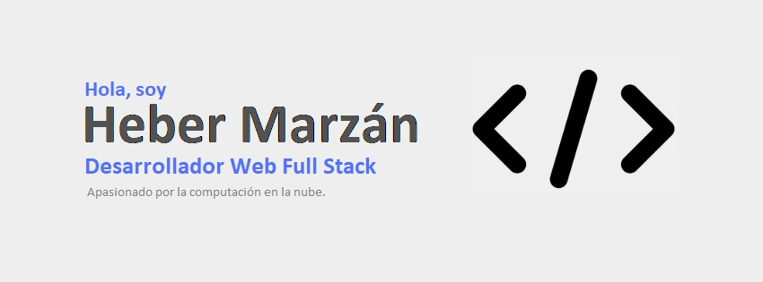

<!-- 
  ¡Hola! Soy Heber Marzán – Desarrollador Web Full Stack con enfoque en Frontend
  Este archivo se muestra automáticamente en tu perfil de GitHub si el repositorio se llama igual que tu usuario.
-->

  
  <h1>🤝🏻¡Hola! Soy Heber Marzán </h1>
  
<em>Desarrollador Web Full Stack | Ingeniero Industrial en transición tecnológica</em>

---

## 👨🏻‍💻 Sobre mí

🤝🏻 !Hola¡ soy **Desarrollador Web Full Stack Junior** especializado en **Desarrollo Frontend**, domino las tecnologías **NextJS, React, TypeScript, JavaScript, Tailwind CSS** con enfoque en la creación de interfaces funcionales, accesibles y centradas en la experiencia del usuario (UX/UI), también desde el lado del backend domino las tecnologías **Node.js, Express, PostgreSQL, MongoDB** con enfoque en la lógica de negocio, la comunicación e integración de servicios.

⚙️ Cuento con mas de 10 años experiencia **No Tech** como **Ingeniero Industrial** especialista en seguridad y salud en el trabajo, y hoy día aplico ese mismo **enfoque analítico y sistemático** al desarrollo de aplicaciones Web limpias, seguras y escalables.

🔎 **Busco integrarme** en equipos de desarrollo donde pueda **combinar mis conocimientos de ingeniería con mi pasión por la tecnología**, contribuyendo así a productos robustos, centrados en el usuario (UX/UI) y alineados con estándares de calidad y seguridad.

---

## 🛠️ Stack Tecnológico:

### 💻 Frontend
- **Next.js** · **React** · **TypeScript** · **JavaScript**
- **Tailwind CSS** · **HTML5** · **CSS3**

### 🛢 Backend & Bases de Datos
- **Node.js** · **Express.js**
- **PostgreSQL** (con **TypeORM**) · **MongoDB** (con **Mongoose**)

### 🔧 DevOps & Colaboración
- **Visual Studio Code** · **Gfit** · **GitHub** · Buenas prácticas de código limpio y arquitectura modular

---

## 🎯 Objetivo

Busco integrarme en un **equipo de desarrollo dinámico** donde pueda:
- Aportar valor con mis habilidades técnicas y visión de procesos,
- Colaborar en proyectos desafiantes,
- Y seguir creciendo como desarrollador web full stack.

---

## 💼 Proyectos destacados

> **VITA RED** (Proyecto grupal – Henry, 2025)
Vita-red es una plataforma de salud digital que conecta pacientes y profesionales, simplificando la gestión de turnos y la experiencia médica.

**Rol: Frontend Developer**
**Funcionalidades:** 
**Tecnologías:** Next.js 14+ (App Router) · TypeScript · Tailwind CSS
**Funcionalidades desarrolladas:**
**Sistema de autenticación:** Diseñé e implementé las interfaces de registro y login con integración completa al backend, asegurando una experiencia de usuario fluida y segura.
**Dashboard Super Admin:** Desarrollé y optimicé la interfaz del panel administrativo con enfoque en la gestión integral de la plataforma, incluyendo:
      - Creación y gestión de usuarios (doctores, secretarias, pacientes)
      - Visualización de estadísticas y métricas clave del sistema
      - Control total de permisos y roles de acceso
> 

---

## 📬 Contacto

- 📍 Arboletes, Antioquia, Colombia
- ✉️ E-mail: [hebermarzan@gmail.com](mailto:hebermarzan@gmail.com)
- 🔗 [LinkedIn](https://www.linkedin.com/in/heber-marz%C3%A1n-74893135)  
- 💼 [Portafolio](https://tuportafolio.com) *(en construcción)*

---

  Gracias por visitar mi perfil 👨‍💻

<!--
**heberzan/heberzan** is a ✨ _special_ ✨ repository because its `README.md` (this file) appears on your GitHub profile.

Here are some ideas to get you started:

- 🔭 I’m currently working on ...
- 🌱 I’m currently learning ...
- 👯 I’m looking to collaborate on ...
- 🤔 I’m looking for help with ...
- 💬 Ask me about ...
- 📫 How to reach me: ...
- 😄 Pronouns: ...
- ⚡ Fun fact: ...
-->
